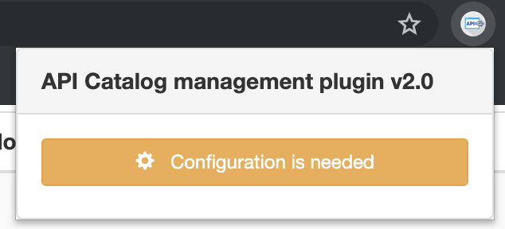
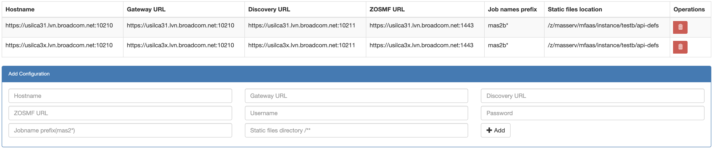
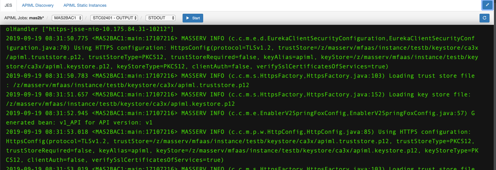
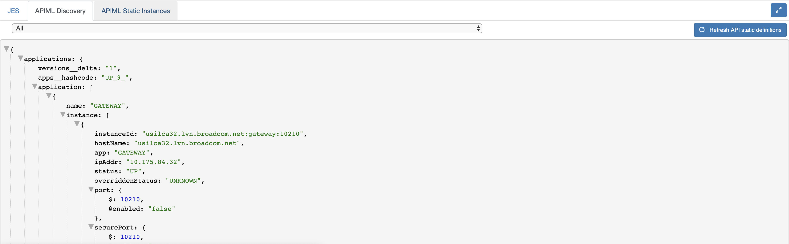
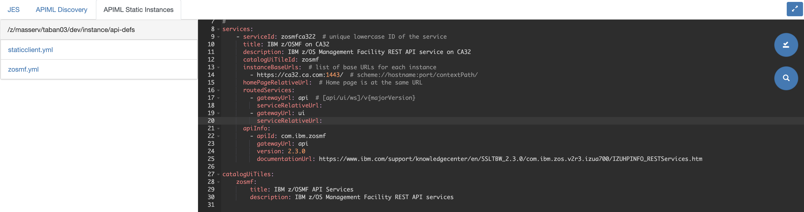

# API Mediation Layer - API Catalog manager
A chrome extension for API Catalog which allows to check job logs, stop the jobs, check eureka metadata, modify static api defs and refresh eureka with them without restarting it.

## Why was there needed to develop this extension?
The purpose of this extension is to facilitate the developer of API Meditation Layer. The extension reduces the amount of time that otherwise the developer would spend for:
1. Checking job logs (STDOUT).
2. Getting APIML Discovery instances metadata
3. Updating or adding static instances to APIML Discovery Service

## Installation
You can clone the repository and open the root folder of the extension on developer mode in chrome extension page.
1. Go to [Chrome extensions(chrome://extensions/)](chrome://extensions/)
2. Enable `Developer mode`
3. Click `Load unpacked` and choose root folder of the extension 

## Configuration
After installation api catalog icon will be enabled in the toolbar and now need to configure extension. You will see popup dialog when you click this icon.

Click the `Configuration is needed` and Configuration page will be shown as a dialog.

There are some parameter asked for configuration below:
- **Host name** - It's name of host configuration which must be unique
- **APIML Gateway URL** - URL of APIML Gateway where you want to see to extension features. `{HOST}:{PORT}`
- **APIML Discovery URL** - URL of APIML Discovery where you want to work with APIML Discovery instance metadatas. `{HOST}:{PORT}`
- **Zosmf URL**  - Zosmf URL. `{HOST}:{PORT}`
- **Username**  - Username of zosmf
- **Password**  - Password of zosmf
- **Job name prefix**  - It's filter for jobs which you can apply and get specific jobs.
- **Static files directory**  - It's directory where your instances yaml defination is located.

### Configuration page
You can get configuration page after right click on extension icon and choose `Options`

You can add configuration or delete existed one.

## How does extension work?

### Certificate Requirements
You should provide hostname certificates which is required for calling their APIs safely.

### Extension Banner
After configuration extension, popup dialog will show you which APIML hosts are configured to go to the host.

After clicking in the URL in the banner, you will be redirected to the API Catalog login page. Login into it and you will be ready to start using the APIML Chrome extension.

The APIML chrome extension consists of three panels:
1. JES Panel
2. APIML Discovery Panel
3. APIML Static Instances Panel

### JES Panel

The JES panel allows you visualize job logs. According to the job prefix you have specified in the configuration, you will get all the APIML jobs under that prefix. 
You can select which type of log you would like to see for the selected job (e.g. STOUT, SYSOUT, JESJCL, etc.) and the log will be visualized in the terminal panel.
You can also filter the jobs by status (ACTIVE/ OUTPUT) and you can stop the job by clicking in the Stop button.

### APIML Discovery Panel

The APIML Discovery Panel allows you to get information about Eureka metadata of discovered instances. By default, the panel will display the whole metadata containing information of all the registered services.
After selecting the service from the dropdown menu, the related service metadata will be displayed.
You can also refresh the Discovery Service with updated static definitions, which can be modified in the APIML Static Instances described later, without actually restarting it.

### APIML Static Instances Panel

The APIML Static Panel allows you to access configuration files for API Static Definitions located in the directory path that you have specified in the configuration.
In the left side of the panel, you can see the files (e.g. `.yml` files) under the directory. On the right side of the panel, an editor is displayed. You can modify the selected yaml configuration file, search and replace characters such as in other editors like Sublime Text, and save the changes directly in the mainframe.

