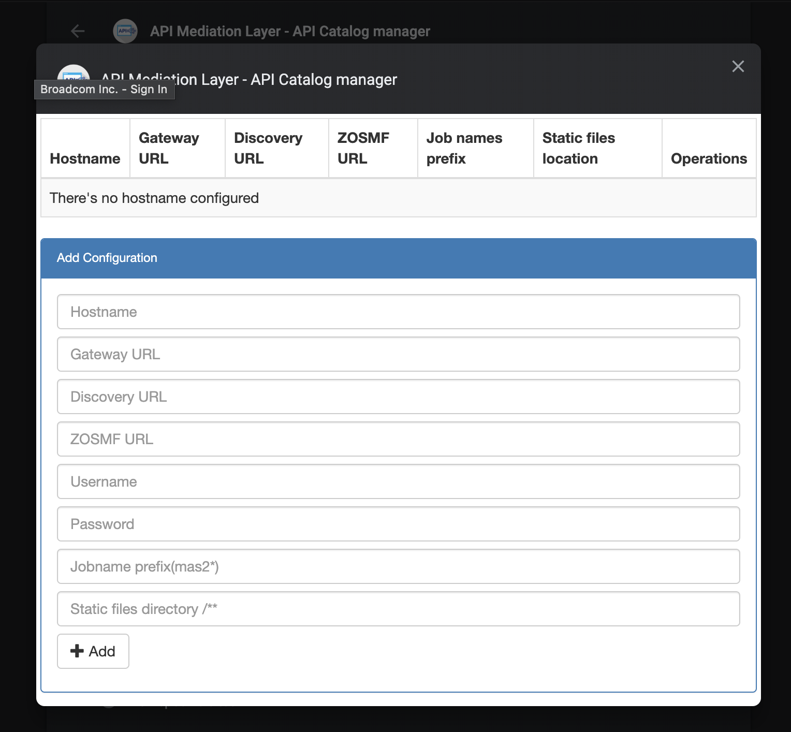

# API Mediation Layer - API Catalog manager
A chrome extension for API Catalog which allows to check job logs, stop the jobs, check eureka metadata, modify static api defs and refresh eureka with them without restarting it.

## Why was there needed to develop this extension?
There are some problems while developing for API Meditation Layer. We called them 'problem' because of the a time to check them. What are they?
1. To check job logs(STDOUT).
2. To check APIML Discovery instances metadatas
3. To Update or add static instanced to APIML Discovery

## Installation
You can clone the repository and open the root folder of the extension on developer mode in chrome extension page.
1. Go to [Chrome extensions](chrome://extensions/)
2. Enable `Developer mode`
3. Click `Load unpacked` and choose root folder of the extension 

## Configuration
After installation api catalog icon will be enabled in the toolbar and now need to configure extension. You will see popup dialog when you click this icon.

Click the `Configuration is need` and Configuration page will be shown as a dialog.

There are some parameter asked for configuration below:
- **Host name** - It's name of host configuration which must be unique
- **APIML Gateway URL** - URL of APIML Gateway where you want to see to extension features. `{HOST}:{PORT}`
- **APIML Discovery URL** - URL of APIML Discovery where you want to work with APIML Discovery instance metadatas. `{HOST}:{PORT}`
- **Zosmf URL**  - Zosmf URL. `{HOST}:{PORT}`
- **Username**  - Username of zosmf
- **Password**  - Password of zosmf
- **Job name prefix**  - It's filter for jobs which you can apply and get specific jobs.
- **Static files directory**  - It's directory where your instances yaml defination is located.

### Configuration page
